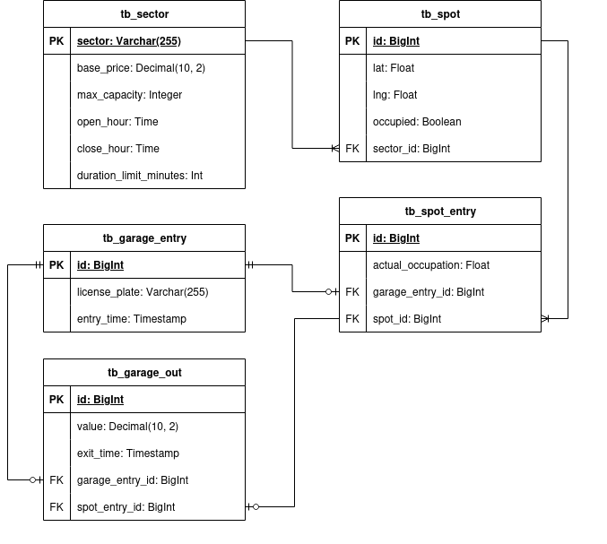

# Teste para vaga Júnior Estapar

## Sistema de gestão de estacionamentos, que controla o número de vagas em aberto, entrada, saida e faturameto do setor.

### Tecnologias utilizadas

- Kotlin
- Spring Boot
- PostgreSQL

Atualmente o projeto recria o banco de dados a cada inicialização.

### Requisitos

- [X] Importar dados do simulador e salvar no banco de dados.
- [X] Regra de preço dinâmico, onde o valor do estacionamento é calculado de acordo com o tempo de permanência do
  veículo.
- [X] Regra de lotação, fechar o setor quando estiver cheio.
- [X] Webhook - entrada na garagem
- [X] Webhook - entrada na vaga
- [X] Webhook - saida da garagem
- [X] Api - Consulta de placa
- [X] Api - Consulta de vaga
- [X] Api - Consulta de faturamento

### Execução
Para executar o projeto, siga os passos abaixo (Nota, o simulador já está dentro do arquivo do docker-compose):
1. Certifique-se de ter o Java 21 instalado.
2. Certique-se de ter o Docker instalado.
3. Certique-se de ter o Docker compose instalado.
4. Criar o arquivo .env e preencher com as informações do banco de dados.

``` dotenv
DATABASE_URL=jdbc:postgresql://localhost:3005/estapar
DATABASE_NAME=estapar
DATABASE_USERNAME=estapar
DATABASE_PASSWORD=estapar
```

Permissão para o gradle:
``` bash
chmod +x gradlew
```

Criar o jar
``` bash
./gradlew clean build
```

Iniciar as aplicações
``` bash
docker-compose up -d --build
```
### OU
Executar tudo de uma vez
``` bash
touch .env &&
echo "DATABASE_URL=jdbc:postgresql://localhost:3005/estapar" >> .env &&
echo "DATABASE_NAME=estapar" >> .env &&
echo "DATABASE_USERNAME=estapar" >> .env &&
echo "DATABASE_PASSWORD=estapar" >> .env &&
chmod +x gradlew && \
./gradlew clean build && \
docker-compose up -d --build
```

### Extras:

Diagrama do banco de dados:


Documentação da api disponível no swagger: http://localhost:3003/swagger-ui/index.html
